# AutoShare

<p align="center">
  
</p>

<p align="center">
  <strong>Automatic file sharing — pair, send, done.</strong>
</p>

---

## 🚀 What is it?

**AutoShare** is a Flutter application that automates file sharing between devices on the same local network (Wi-Fi / Hotspot). Similar to [LocalSend](https://github.com/localsend/localsend), but with a key difference:

> 🔗 Once paired, files are **automatically accepted** and a notification is sent — no need to manually confirm each transfer.

## ✨ Features

| Feature | Description |
|---|---|
| 🔍 **Auto Discovery** | Automatically finds devices on the same network via UDP broadcast |
| 🤝 **Secure Pairing** | One-time token-based pairing system |
| 📁 **Auto Accept** | Files from paired devices are accepted automatically |
| 🔔 **Notifications** | Push notification when transfer completes |
| 📂 **Built-in File Manager** | View, delete, move, or share received files |
| 🖥️ **Cross Platform** | Android and Windows support |
| 🌐 **Hotspot Support** | Works on mobile hotspot networks |

## 📱 Supported Platforms

- ✅ **Android** (arm64, armeabi-v7a, x86_64)
- ✅ **Windows** (x64)

## 🖼️ Play Store Assets (v2)

### Feature Graphic

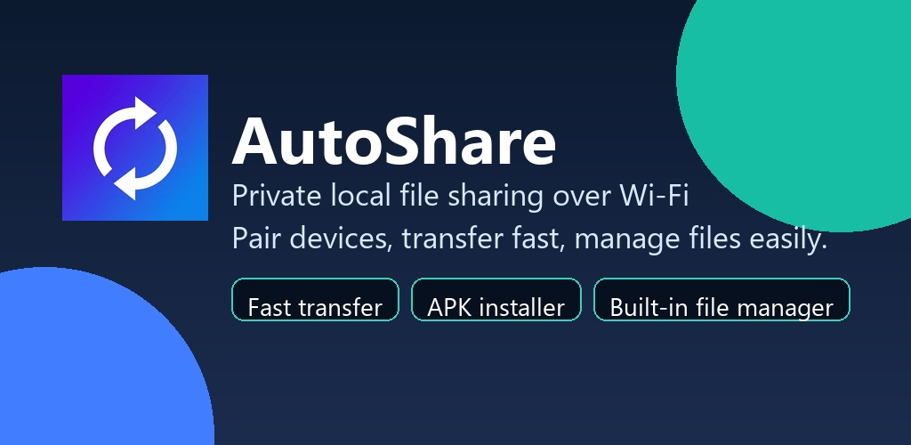

### Phone Screenshots

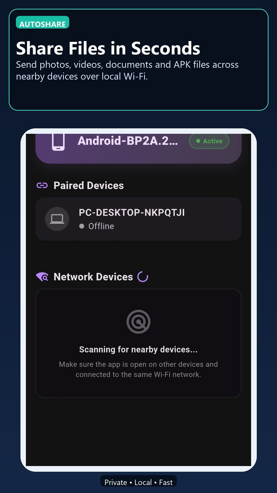
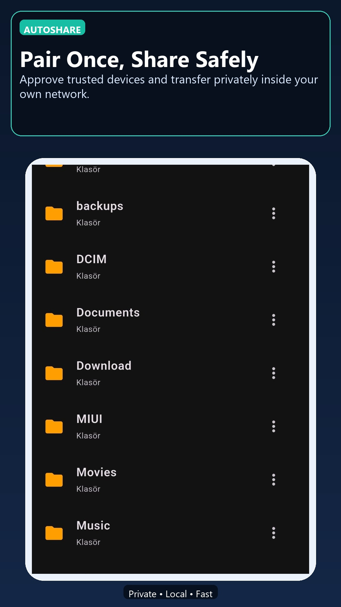
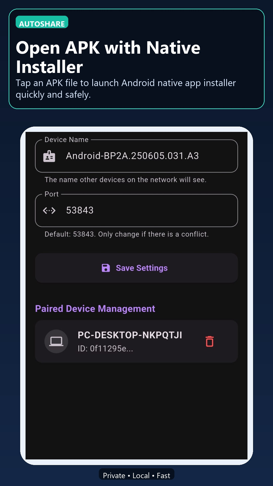
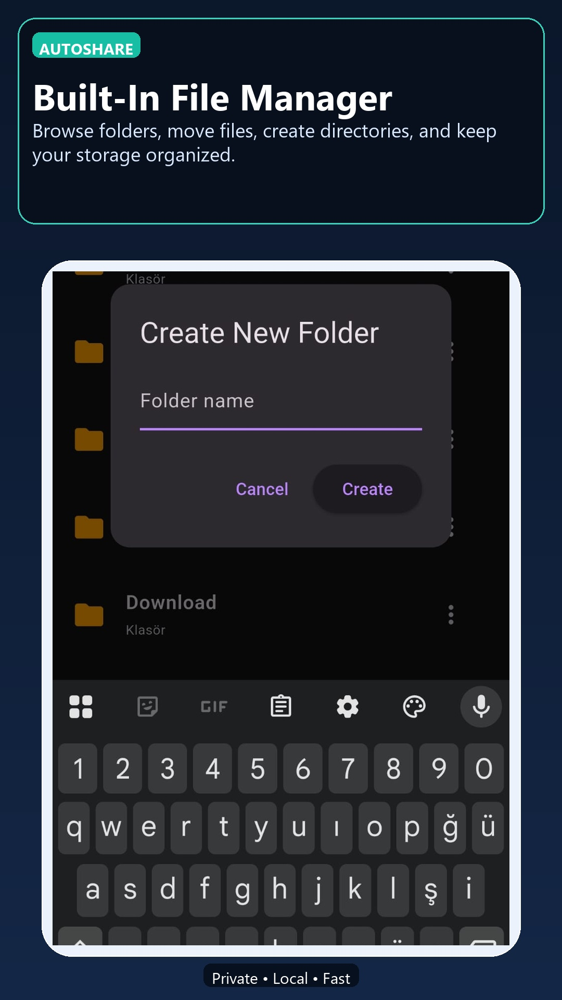
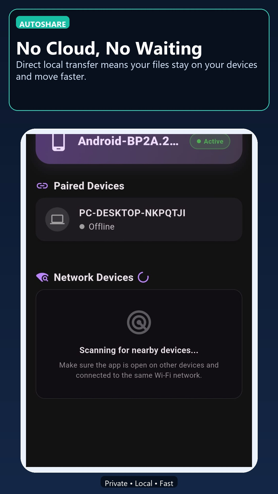
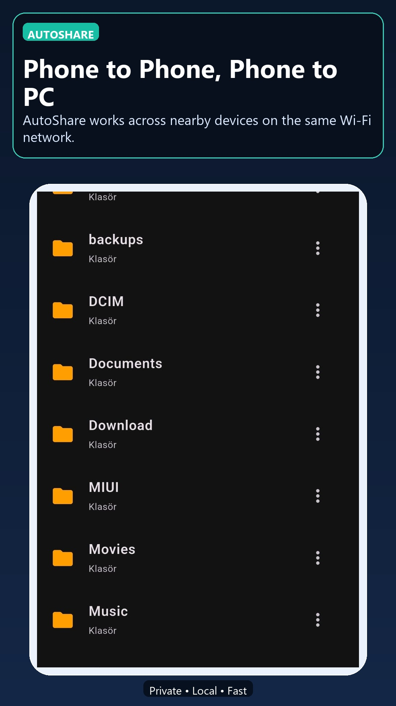
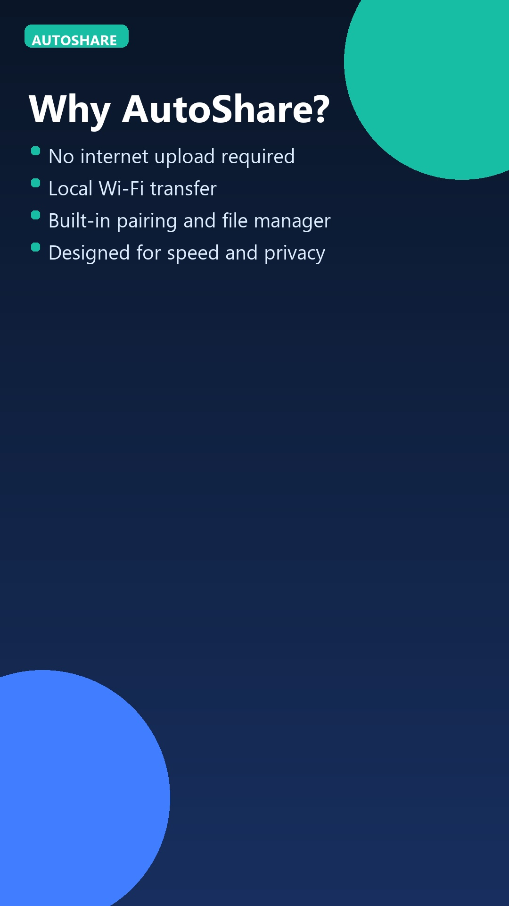
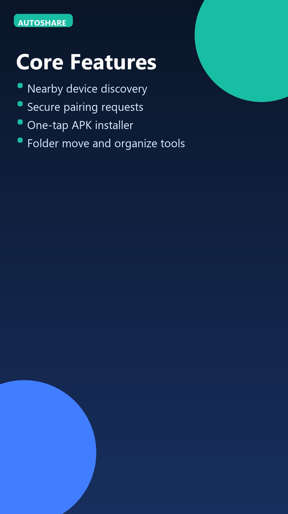

### Tablet Screenshots

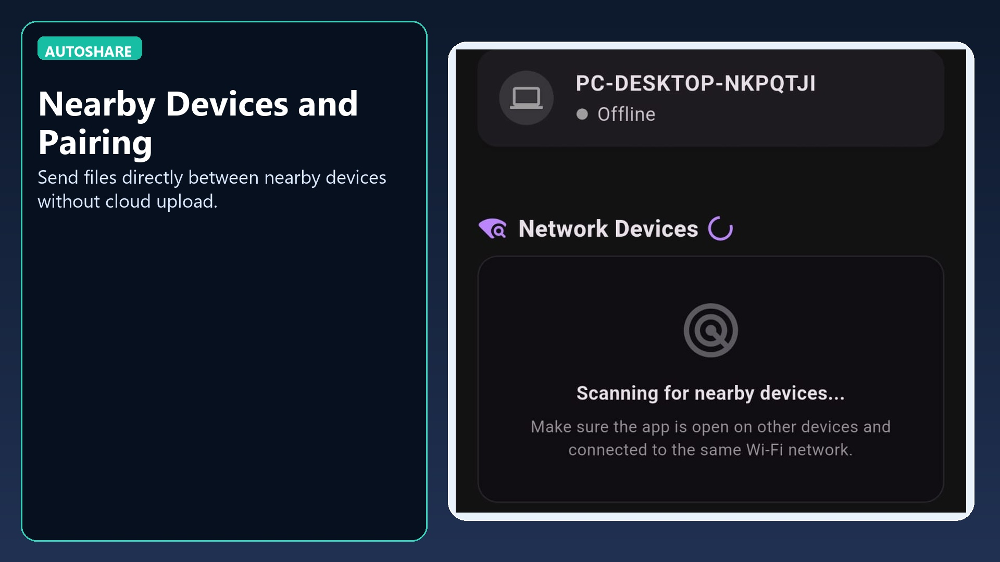
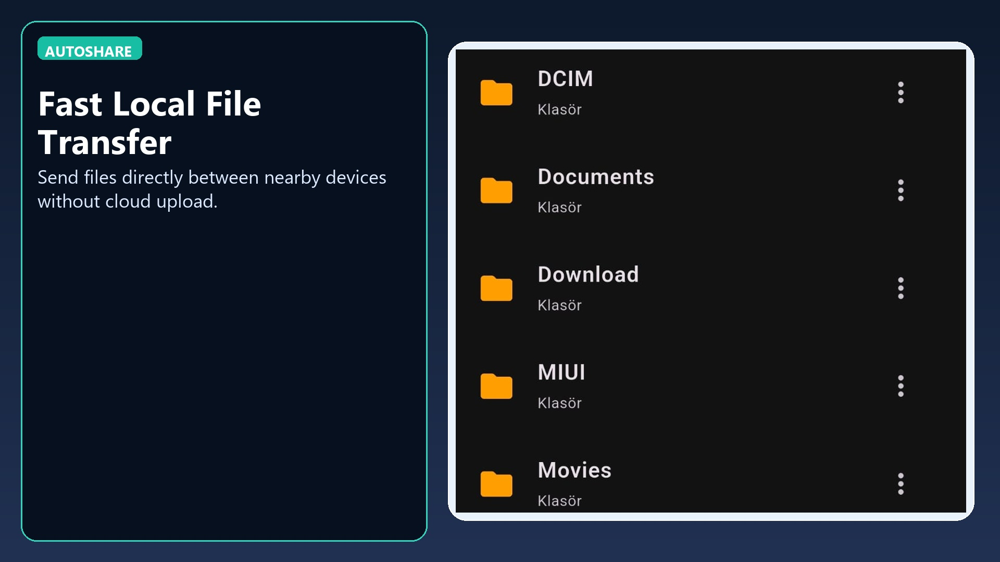

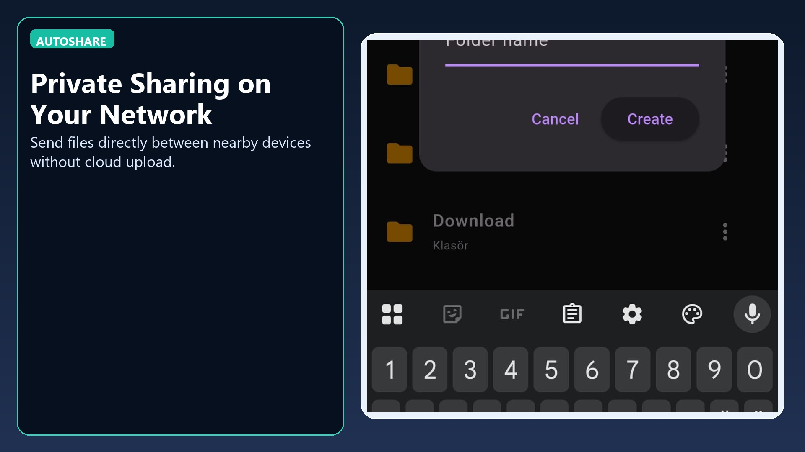

## 🏗️ Architecture

```
autoshare/
├── lib/
│   ├── main.dart                    # App entry point
│   ├── models/
│   │   ├── device_node.dart         # Device model
│   │   └── shared_file.dart         # File model
│   ├── screens/
│   │   ├── dashboard_screen.dart    # Main screen
│   │   ├── file_manager_screen.dart # File manager
│   │   └── settings_screen.dart     # Settings
│   └── services/
│       ├── discovery_service.dart   # UDP device discovery
│       ├── notification_service.dart# Notification service
│       ├── storage_service.dart     # Storage and preferences
│       └── transfer_service.dart    # HTTP file transfer
├── packages/
│   └── flutter_local_notifications_windows_stub/
└── assets/
    └── icon.png                     # App icon
```

### Service Layers

| Service | Protocol | Port | Description |
|---|---|---|---|
| **DiscoveryService** | UDP Broadcast | 53842 | Device discovery and presence announcement |
| **TransferService** | HTTP | 53843 | File transfer and pairing handshake |
| **NotificationService** | — | — | Android local notifications |
| **StorageService** | — | — | SharedPreferences + file system |

## 🔧 Setup & Running

### Requirements

- Flutter SDK 3.11+
- Android SDK (for Android builds)
- Visual Studio 2019+ (for Windows builds)

### Development

```bash
flutter pub get
flutter analyze
flutter run -d android
flutter run -d windows
```

### Building

```bash
# Android APK (split by ABI)
flutter build apk --split-per-abi

# Windows EXE
flutter build windows
```

## 📋 Usage

1. **Install AutoShare on both devices**
2. **Connect to the same Wi-Fi network** (or one device's hotspot)
3. **Devices will automatically discover each other**
4. **Send a pairing request** and accept on the other device
5. **Send files** — paired devices auto-accept
6. **Tap the notification** to view the received file in the built-in file manager

## 🔒 Security

- Random UUID v4 token generated during pairing
- File transfers only accepted with a valid `pairToken`
- Transfers from unpaired devices are automatically rejected

## 📄 License

This project is licensed under the MIT License.
